# KYC Platform

End‑to‑end Know‑Your‑Customer (KYC) flow built on **AWS Lambda, SQS, Textract, Rekognition, RDS (PostgreSQL)** and **Apify**.  This repository contains:

* Live architecture and data‑flow diagrams (Mermaid)
* A step‑by‑step processing table with example payloads
* Patch SQL to bring the schema in line with the flow

> GitHub renders Mermaid automatically – just open this README and the graphs will paint themselves.

---

## 📁 Quick Links

| Artifact                          | File                                                 |
| --------------------------------- | ---------------------------------------------------- |
| Process flow table (enum‑aligned) | [`kyc_flow_docs.md`](./kyc_flow_docs.md)             |
| Schema patch SQL                  | [`Kyc Schema Patch.sql`](./Kyc%20Schema%20Patch.sql) |

---

## 1  High‑Level Component Diagram

```mermaid
%%  KYC platform – component diagram 
graph TD

    %% ─────────  EXTERNAL ACTORS  ─────────
    subgraph "External Actors"
        User["User / Browser"]
        CSUI["CS Review UI"]
    end

    %% ─────────  AWS KYC PLATFORM  ───────
    subgraph "KYC Platform (AWS account)"
        direction TB

        S3[(S3 Bucket<br/>kyc-raw/…)]:::store

        FaceQ[[face-match SQS]]:::queue
        RegReqQ[[reg-request SQS]]:::queue
        RegRespQ[[reg-check-ingest SQS]]:::queue
        DecQ[[decision SQS]]:::queue

        DocScan[[doc_scan_lambda]]:::lambda
        ReqMaker[[reg_request_lambda]]:::lambda
        FaceMatch[[face_match_lambda]]:::lambda
        RegCheck[[reg_check_lambda]]:::lambda
        Decision[[decision_lambda]]:::lambda
        Expiry[[expiry_reminder_lambda]]:::lambda

        DB[(RDS PostgreSQL)]:::store
    end

    %% ─────────  SQL02 ON-PREM / EDGE  ─────────
    subgraph "SQL02 On-prem"
        OnPremSvc["onprem_upload_service"]:::lambda
        DataSyncAgent["AWS DataSync Agent"]:::source
    end

    %% ─────────  REGISTERS / APIFY  ───────
    subgraph APIFY_BOX["Registers / Apify scrapers"]
        direction LR
        ApifyGDC["GDC Register Scraper"]
        ApifyNMC["NMC Register Scraper"]
        ApifyGMC["GMC Register Scraper"]
        ApifyGPC["GPC Register Scraper"]
    end

    %% ─────────  AWS AI SERVICES  ─────────
    subgraph "AWS AI services"
        direction TB
        Textract[(Amazon Textract)]:::ai
        Rekog[(Amazon Rekognition)]:::ai
    end

    %% ─────────  NOTIFICATION  ───────────
    subgraph "Notifications"
        NotifySNS["SNS / Webhook"]
        NotifyEmail["Email to CS"]
    end

    %% ─────────  FLOWS ─────────
    User -->|"PUT ID & selfie"| OnPremSvc
    OnPremSvc -- "copy files" --> DataSyncAgent
    DataSyncAgent -->|"PUT objects"| S3

    S3 -- "ObjectCreated" --> DocScan
    DocScan -- "invoke OCR"       --> Textract
    Textract -- "JSON result"     --> DocScan
    DocScan -- "rows to DB"       --> DB
    DocScan -- "msg user_id"      --> FaceQ
    DocScan -- "msg reg_no/type"  --> RegReqQ

    FaceQ --> FaceMatch
    FaceMatch -- "invoke compare/liveness" --> Rekog
    Rekog -- "JSON result"                 --> FaceMatch
    FaceMatch -- "row face_checks"         --> DB
    FaceMatch -- "msg user_id"             --> DecQ

    RegReqQ --> ReqMaker
    ReqMaker -- "HTTP POST"      --> APIFY_BOX
    APIFY_BOX -- "JSON response" --> RegRespQ

    RegRespQ --> RegCheck
    RegCheck -- "row reg_checks" --> DB
    RegCheck -- "msg user_id"    --> DecQ

    DecQ --> Decision
    Decision -- "insert kyc_decisions⏎update users" --> DB
    Decision -- "PASS"          --> NotifySNS
    Decision -- "MANUAL_REVIEW" --> NotifyEmail

    Expiry -- "select expiring IDs" --> DB
    Expiry -- "90/30/7-day emails"  --> NotifyEmail
    Expiry -- "force re-upload"     --> User

    %% ─────────  STYLING  ─────────
    classDef lambda fill:#004B76,stroke:#fff,color:#fff;
    classDef queue  fill:#C0D4E4,stroke:#004B76,color:#000;
    classDef store  fill:#F8F8F8,stroke:#555,color:#000;
    classDef source fill:#FFF4CE,stroke:#C09,color:#000;
    classDef ai     fill:#7A5FD0,stroke:#fff,color:#fff;

    class OnPremSvc,DocScan,ReqMaker,FaceMatch,RegCheck,Decision,Expiry lambda;
    class FaceQ,RegReqQ,RegRespQ,DecQ queue;
    class S3,DB store;
    class DataSyncAgent source;
    class Textract,Rekog ai;
```



---

## 2  Detailed Flow Diagram (with AI round‑trips & fan‑in queue)

```mermaid
%%  KYC flow – full round‑trip AI calls + clarified SNS name
<REPLACE_WITH_FINAL_FLOW_DIAGRAM_CODE>
```

*The `<REPLACE_WITH_FINAL_FLOW_DIAGRAM_CODE>` placeholder is replaced in the actual file with the full Mermaid code from the latest flow diagram (kept identical to* **kyc\_flow\_docs.md** *to avoid drift).*

---

## 3  Process Step Descriptions (Enum-Aligned)

<details>
<summary>Click to expand step‑by‑step table</summary>

| Step   | Trigger / Source                        | Service                  | Action                            | DB Writes                                                       | Example Columns                                                                                                        | Next                                  |
| ------ | --------------------------------------- | ------------------------ | --------------------------------- | --------------------------------------------------------------- | ---------------------------------------------------------------------------------------------------------------------- | ------------------------------------- |
| **0**  | User uploads ID & selfie → on-prem → S3 | `onprem_upload_service`  | Accept files, create user/doc     | `users` INSERT<br>`id_documents` INSERT (`status='NEW'`)        | - `email = dr.jane@example.com`<br>- `reg_no = 6143219`<br>- `status = PENDING`<br>- `doc_type = passport`             | *(none)*                              |
| **1**  | `S3:ObjectCreated` event                | `doc_scan_lambda`        | Textract OCR, parse metadata      | `doc_scans` INSERT<br>`selfies` INSERT<br>`id_documents` UPDATE | - `parsed_name = JANE ANN DOE`<br>- `parsed_dob = 1985-02-14`<br>- `expiry_date = 2032-05-01`<br>- `status = OCR_DONE` | `face-match` SQS<br>`reg-request` SQS |
| **2**  | SQS: face-match                         | `face_match_lambda`      | Rekognition face + liveness check | `face_checks` INSERT                                            | - `match_score = 0.93`<br>- `liveness_pass = true`                                                                     | `decision` SQS                        |
| **3**  | SQS: reg-request                        | `reg_request_lambda`     | Call Apify scraper (async)        | —                                                               | —                                                                                                                      | *(wait Apify)*                        |
| **3a** | Apify returns result                    | *(Apify)*                | Publish response to SQS           | —                                                               | —                                                                                                                      | `reg-check-ingest` SQS                |
| **3b** | SQS: reg-check-ingest                   | `reg_check_lambda`       | Store register results            | `reg_checks` INSERT                                             | - `matched_name = true`<br>- `matched_status = true`                                                                   | `decision` SQS                        |
| **4**  | SQS: decision                           | `decision_lambda`        | Aggregate and decide KYC result   | `kyc_decisions` INSERT<br>`users` UPDATE                        | - `decision = PASS`<br>- `status = VERIFIED`                                                                           | SNS / Email                           |
| **5**  | Manual override                         | —                        | CS approves / rejects             | `kyc_decisions` UPDATE<br>`users` UPDATE                        | —                                                                                                                      | —                                     |
| **6**  | Weekly CloudWatch Event                 | `expiry_reminder_lambda` | Notify about expiring IDs         | *(read-only)*                                                   | - IDs within 90/30/7 days                                                                                              | Notify topic                          |

</details>

---

## 4  Entity‑Relationship Diagram

```mermaid
erDiagram
  users {
    BIGSERIAL id PK
    VARCHAR email
    VARCHAR reg_no
    reg_type_enum reg_type
    user_status_enum status
    TIMESTAMPTZ created_at
  }

  id_documents {
    BIGSERIAL id PK
    BIGINT user_id FK
    TEXT s3_key_original
    VARCHAR doc_type
    id_doc_status_enum status
    DATE expiry_date
    TIMESTAMPTZ created_at
  }

  selfies {
    BIGSERIAL id PK
    BIGINT user_id FK
    TEXT s3_key
    TIMESTAMPTZ created_at
  }

  doc_scans {
    BIGSERIAL id PK
    BIGINT id_document_id FK
    JSONB textract_json
    TEXT parsed_name
    DATE parsed_dob
    DATE parsed_expiry
    VARCHAR parser_version
    TIMESTAMPTZ completed_at
  }

  face_checks {
    BIGSERIAL id PK
    BIGINT user_id FK
    BIGINT selfie_id FK
    BIGINT id_document_id FK
    NUMERIC match_score
    BOOLEAN liveness_pass
    VARCHAR rekognition_job_id
    TIMESTAMPTZ completed_at
  }

  reg_checks {
    BIGSERIAL id PK
    BIGINT user_id FK
    DATE snapshot_date
    BOOLEAN matched_name
    BOOLEAN matched_status
    JSONB raw_response_json
    TIMESTAMPTZ checked_at
  }

  kyc_decisions {
    BIGSERIAL id PK
    BIGINT user_id FK
    kyc_decision_enum decision
    TEXT[] reasons
    TIMESTAMPTZ decided_at
  }

  users ||--o{ id_documents
  users ||--o{ selfies
  users ||--o{ face_checks
  users ||--o{ reg_checks
  users ||--o{ kyc_decisions
  id_documents ||--o{ doc_scans
  id_documents ||--o{ face_checks
  selfies ||--o{ face_checks
```

---

### Running Locally

```bash
psql $DB_URL -f "Kyc Schema Patch.sql"
```

---

### Contributing

PRs welcome – please update diagrams + docs if queue names, enum values, or DB tables change.
